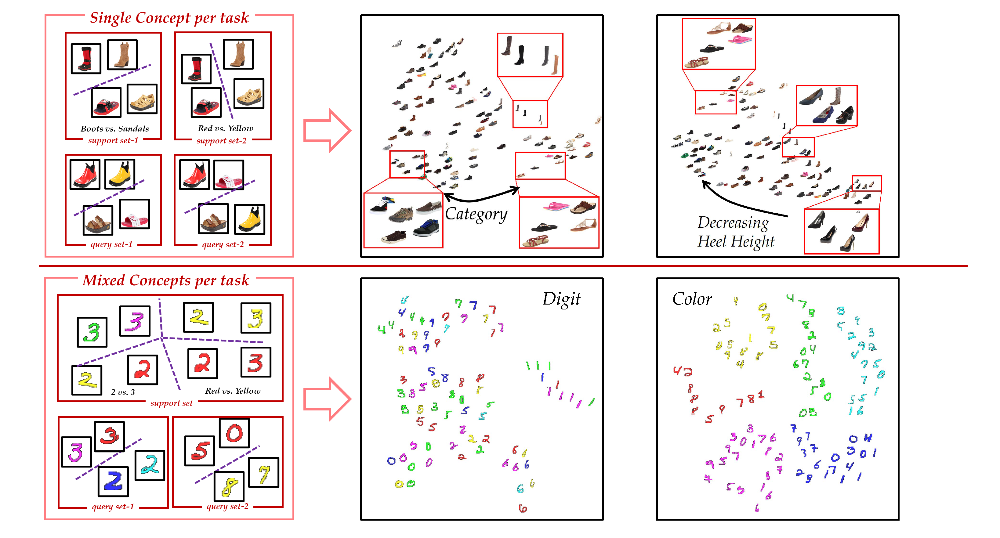

# Contextualizing Meta-Learning via Learning to Decompose

The PyTorch code for LeadNet in the paper "[Contextualizing Meta-Learning via Learning to Decompose](https://arxiv.org/abs/2106.08112) (TPAMI 2023)". If you use any content of this repo for your work, please cite the following bib entry:

       
	@article{ye2023contextualizing,
		title={Contextualizing Meta-Learning via Learning to Decompose},
		author={Ye, Han-Jia and Zhou, Da-Wei and Hong, Lanqing and Li, Zhenguo and Wei, Xiu-Shen and Zhan, De-Chuan},
		journal={IEEE Transactions on Pattern Analysis and Machine Intelligence},
		year={2023},
		publisher={IEEE}
	}

## Main idea of LeadNet

Meta-learning has shown its ability to construct a target model based on a support set efficiently for various kinds of machine learning problems, e.g., the meta-learned embeddings pull an instance close to its same-class neighbors for a nearest-neighbor classifier. However, one single instance could possess multiple portraits, i.e., be annotated from various attributes, so that the labels of visually similar instances could be different across or even inside support sets. Thus, a uniform correspondence between a support set and its target model ignores the latent attributes of instances and is difficult to handle the instance-wise ambiguous similarity. To this end, we propose Learning to Decompose Network (LeadNet) to contextualize a meta-model by applying the meta-map corresponding to the attribute inferred from the support set contexts --- either instances are labeled from one attribute or mixed attributes in a support set. In particular, the comparison relationship between instances is decomposed w.r.t. multiple embedding spaces, and LeadNet learns to automatically select the meta-model associated with the right attribute via incorporating the change of comparison across contexts with polysemous embeddings. LeadNet demonstrates its superiority in various applications, including exploring multiple views of confusing data, its high discriminative ability with out-of-distribution recognition, and its promising performance on few-shot image classification.  

Here are the two scenarios when there exist rich semantics among tasks, including the problem illustration (left) and the t-SNE of decomposed multiple conceptual embeddings by LeadNet (right). *Upper*: each task is annotated based on a certain concept and the same instance could be labeled differently in tasks. A contextualized model learned from the support set is asked to discern instances in the corresponding query set. *Lower*: the four-class instances in the support set are labeled by two concepts. The model should capture both concepts and handle two query sets jointly. 

## Standard Few-shot Learning Results

Experimental results on few-shot learning datasets with ResNet-12 backbone (Same as the [MetaOptNet](https://github.com/kjunelee/MetaOptNet)). We report average results with 10,000 randomly sampled few-shot learning episodes for stablized evaluation.

**MiniImageNet Dataset**
|  Setups  | 1-Shot 5-Way | 5-Shot 5-Way |
|:--------:|:------------:|:------------:|
|   MAML   |     58.37   |     69.76    |
|    ProtoNet   |     60.37   | 78.02    |
|  MetaOptNet  |     62.64    |     78.63    |
| DeepEMD |     65.91    |     82.41    |
|    FEAT   |     66.78  |     82.05    |
|   LeadNet (Ours)   |   **67.32**  |   **83.21**  |

## Prerequisites

The following packages are required to run the scripts:

- [PyTorch-1.6 and torchvision](https://pytorch.org)

- Package [tensorboardX](https://github.com/lanpa/tensorboardX)

- Dataset: please download the dataset and put images into the folder data/[name of the dataset, miniimagenet or cub]/images

- Pre-trained weights: We use the released weights of [FEAT](https://drive.google.com/file/d/1XcUZMNTQ-79_2AkNG3E04zh6bDYnPAMY/view?usp=sharing).

## Dataset

### MiniImageNet Dataset

The MiniImageNet dataset is a subset of the ImageNet that includes a total number of 100 classes and 600 examples per class. We follow the [previous setup](https://github.com/twitter/meta-learning-lstm), and use 64 classes as *base* categories, 16 and 20 as two sets of *novel* categories for model validation and evaluation, respectively.

## Code Structures
To reproduce our experiments with UNICORN-MAML, please use **train_mode.py**. There are four parts in the code.
 - `model`: It contains the main files of the code, including the few-shot learning trainer, the dataloader, the network architectures, and baseline and comparison models.
 - `data`: Images and splits for the data sets.
 - `saves`: The pre-trained weights of different networks.

## Model Training and Evaluation
Please use **train_mode.py** and follow the instructions below. The file will automatically evaluate the model on the meta-test set with 10,000 tasks after given epochs. 

## Arguments
The train_mode.py takes the following command line options:

**Task Related Arguments**
- `dataset`: Option for the dataset (`MiniImageNet`, `TieredImageNet`, or `CUB`), default to `MiniImageNet`

- `way`: The number of classes in a few-shot task during meta-training, default to `5`

- `shot`: Number of instances in each class in a few-shot task during meta-training, default to `1`

- `eval_shot`: Number of instances in each class in a few-shot task during meta-test, default to `1`

- `query`: Number of instances in each class to evaluate the performance during meta-training, default to `15`

**Optimization Related Arguments**
- `max_epoch`: The maximum number of training epochs, default to `100`

- `lr`: Learning rate for the model, default to `0.001` with pre-trained weights

- `step`: The step scheduler to decrease the learning rate. Set it to a single value if choose the `step` scheduler. Default to `20`

- `gamma`: Learning rate ratio for `step` scheduler, default to `0.1`

**Model Related Arguments**
- `model_type`: The model to use during meta-learning. We provide implementations for `ProtoNet` and our`LeadNet`. Default to `LeadNet`

- `backbone_class`: Types of the encoder, i.e., ResNet-12 (`Res12`), default to `ConvNet`

- `temperature`: Temperature over the logits, we #divide# logits with this value. It is useful when meta-learning with pre-trained weights. Default to `1`

- `temperature2`: Temperature in the regularization, we #divide# logits with this value. We do not tune it in the implementation. Default to `1`

- `n_concept`: How many latent concepts we consider during meta-training. Default to `1`

**Other Arguments** 

- `gpu`: The index of GPU to use. Please provide multiple indexes if choose `multi_gpu`. Default to `0`

Running the command without arguments will train the models with the default hyper-parameter values. Loss changes will be recorded as a tensorboard file.

## Training scripts for LeadNet

For example, to train the 1-shot/5-shot 5-way LeadNet model with ResNet-12 backbone on MiniImageNet:

    $ python train_model.py --dataset MiniImageNet --model_type LeadNet --backbone_class Res12 --way 5 --query 15 --shot 1 --eval_shot 1 --max_epoch 100 --lr 0.001 --step 10 --gamma 0.5 --init_weights './saves/initialization/miniimagenet/Res12-pre.pth' --gpu 0 --n_concept 64 --num_tasks 1 --balance  0.001 --temperature 1 --temperature2 1.0 >> TieredLead-a1.txt
	$ python train_model.py --dataset MiniImageNet --model_type LeadNet --backbone_class Res12 --way 5 --query 15 --shot 1 --eval_shot 5 --max_epoch 100 --lr 0.001 --step 10 --gamma 0.5 --init_weights './saves/initialization/miniimagenet/Res12-pre.pth' --gpu 0 --n_concept 64 --num_tasks 1 --balance  0 --temperature 1 --temperature2 1.0 >> TieredLead-a1.txt
